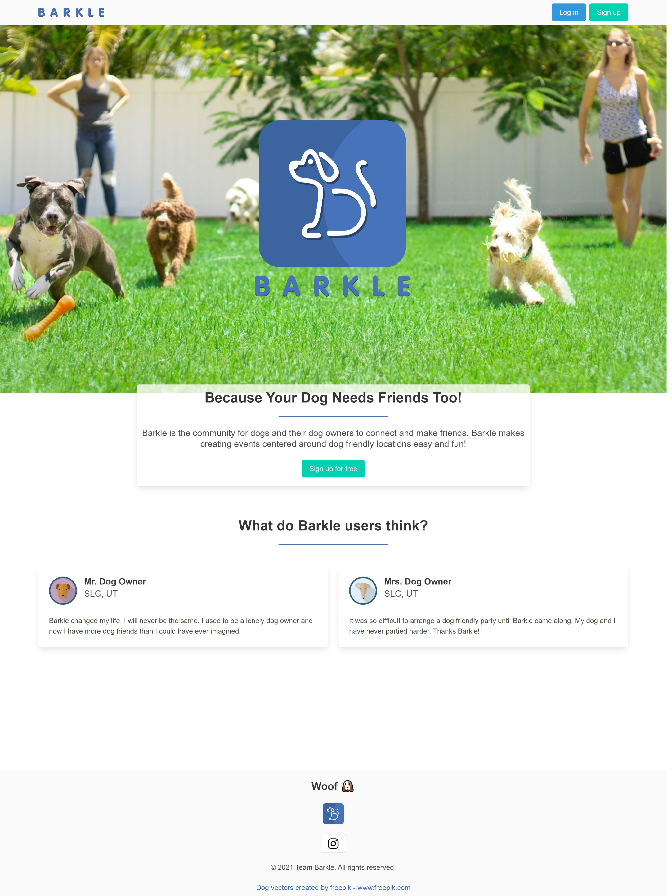

># Barkle

---

#### Barkle is a web app designed to facilitate meetups for dogs and their humans at dog-friendly locations. We want you and your dog to make new friends!
---

>## Table of Contents
---
- [Installation](###Installation)
- [Usage](###Usage)
- [License](###License)
- [Questions](###Questions)
    
>### Installation
    
No installation is necessary as this is a web based platform run on heroku, if you would like to see dependencies please visit the [repository](https://github.com/Jpeyton-hub/Barkle)!

---
    
>### Usage
    
In your preferred web browser go to [The Barkle Homepage](https://barkle.herokuapp.com/) to create an account. Input your email, a unique username and a password. You will then be taken to a create profile page and on Barkle, your dogs are your profile! follow the prompts to add a dog to your profile and then hit submit. You will be taken to your profile home page where you can add more dogs if you wish. At the top of the page you will see a navbar with the option to create an event or head to the event dashboard. To schedule your own event head to the create event page and enter all the event information. There is a map and searchbar to the right side of the page if you need any help finding a dog friendly place near you! once your event is added it will appear in the event feed on the event dashboard page where other users can see it, like it and visit the message board associated with the event. You can filter the event feed with the filter options at the top of the dashboard as well. Each time you see someone's username on Barkle you can click on it to see information about their pups! To visit an event's messageboard click on the event forum link within the event's card on the dashboard. On the event forum you can write messages for others to see and these will populate in the posts feed in the middle of the page, be sure to like your favorite posts!

---

>### License
    
Copyright 2021 Team Barkle

           Permission is hereby granted, free of charge, to any person obtaining a copy of this software and associated documentation files (the "Software"), to deal in the Software without restriction, including without limitation the rights to use, copy, modify, merge, publish, distribute, sublicense, and/or sell copies of the Software, and to permit persons to whom the Software is furnished to do so, subject to the following conditions:
           
           The above copyright notice and this permission notice shall be included in all copies or substantial portions of the Software.
           
           THE SOFTWARE IS PROVIDED "AS IS", WITHOUT WARRANTY OF ANY KIND, EXPRESS OR IMPLIED, INCLUDING BUT NOT LIMITED TO THE WARRANTIES OF MERCHANTABILITY, FITNESS FOR A PARTICULAR PURPOSE AND NONINFRINGEMENT. IN NO EVENT SHALL THE AUTHORS OR COPYRIGHT HOLDERS BE LIABLE FOR ANY CLAIM, DAMAGES OR OTHER LIABILITY, WHETHER IN AN ACTION OF CONTRACT, TORT OR OTHERWISE, ARISING FROM, OUT OF OR IN CONNECTION WITH THE SOFTWARE OR THE USE OR OTHER DEALINGS IN THE SOFTWARE.
           (https://opensource.org/licenses/MIT) 

---

    
>### Questions
    
If you have a questions please connect with me on Github [Jpeyton-hub](https://github.com/Jpeyton-hub)
or send me an email at <jpwalk319@gmail.com>

---
    
#### Thanks for Viewing!

